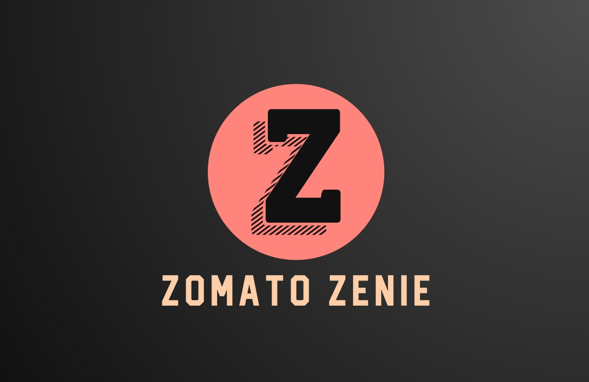
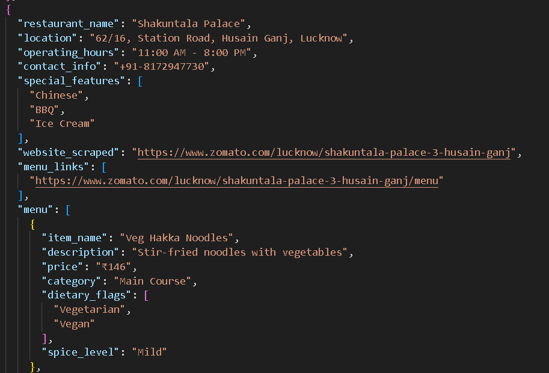
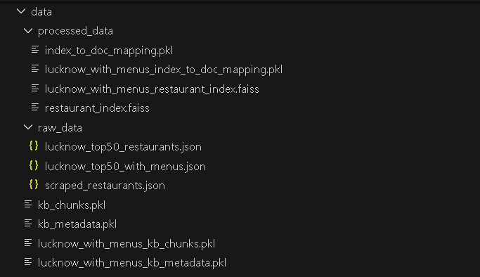
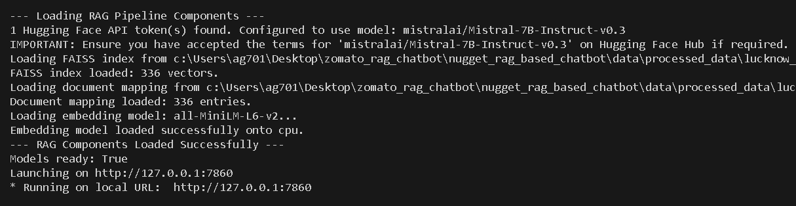
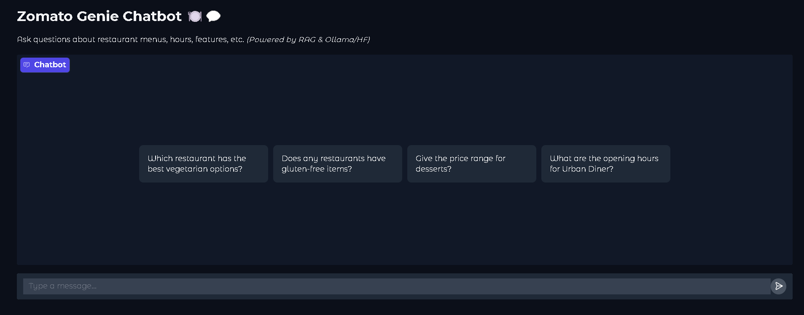

<a name="readme-top"></a>

<!-- PROJECT LOGO -->
<br />
<h1 align="center">Zomato Zenie: Restaurant Data Scraper & RAG-based Chatbot</h1>
<div align="center">
  <a href="https://github.com/Ayushlion8/nugget_rag_based_chatbot">
    
  </a>
  <p align="center">
    Zomato Zenie combines robust web scraping and Retrieval-Augmented Generation (RAG) to answer questions about restaurant menus, dietary options, pricing, and more in real-time.
    <br />
    <a href="https://github.com/Ayushlion8/nugget_rag_based_chatbot">View Repository</a>
    ·
    <a href="https://youtu.be/your_demo_link">Watch the Demo</a>
    ·
    <a href="#contributing">Contributing</a>
  </p>
</div>

<details>
  <summary><h2>Table of Contents</h2></summary>
  <ol>
    <li><a href="#about-the-project">About The Project</a></li>
    <li><a href="#key-features">Key Features</a></li>
    <li><a href="#built-with">Built With</a></li>
    <li><a href="#how-it-works">How It Works</a>
      <ul>
        <li><a href="#web-scraper">Web Scraper</a></li>
        <li><a href="#knowledge-base-creation">Knowledge Base Creation</a></li>
        <li><a href="#rag-chatbot">RAG Chatbot</a></li>
        <li><a href="#user-interface">User Interface</a></li>
      </ul>
    </li>
    <li><a href="#getting-started">Getting Started</a></li>
    <li><a href="#license">License</a></li>
    <li><a href="#contributing">Contributing</a></li>
    <li><a href="#team">Team</a></li>
  </ol>
</details>

## About The Project

Zomato Zenie streamlines restaurant discovery by scraping live menu details, dietary tags, prices, and operating hours from multiple websites. Leveraging a RAG pipeline, it retrieves relevant data snippets and generates clear, contextual answers to natural-language queries.

<p align="right">(<a href="#readme-top">back to top</a>)</p>

## Key Features

- *Live Data Scraping:* Extracts restaurant name, location, menu items, descriptions, prices, dietary flags (vegetarian, vegan, gluten-free), spice levels, hours, and contact info using Playwright and BeautifulSoup.<br/>
- *Structured Knowledge Base:* Cleans, normalizes, and chunks data. Embeds passages with sentence-transformers/all-MiniLM-L6-v2 for vector search.<br/>
- *RAG Architecture:* Retrieves relevant passages from FAISS, then generates responses using the mistralai/Mistra1-7B-Instruct-v0.3 model via Hugging Face Inference API.<br/>
- *Multi-Intent Handling:* Supports menu availability, price range queries, dietary restrictions, feature comparisons, and more.<br/>
- *Conversation Context:* Maintains history across turns for coherent follow-up questions.<br/>
- *Simple UI:* Interactive CLI or Gradio web interface for user testing and demos.

<p align="right">(<a href="#readme-top">back to top</a>)</p>

## Built With

- *Python 3.9+*
- *Playwright* for dynamic page rendering
- *BeautifulSoup4* for HTML parsing
- *pdfplumber* for PDF menu extraction
- *requests* for HTTP requests
- *sentence-transformers* (all-MiniLM-L6-v2) for embeddings
- *faiss-cpu* for fast vector search
- *transformers & huggingface-hub* for RAG generation (mistralai/Mistra1-7B-Instruct-v0.3)
- *Gradio* for the web UI
- *dotenv* for environment variable management
- *GitHub Actions* for CI/CD

<p align="right">(<a href="#readme-top">back to top</a>)</p>

## How It Works

### Web Scraper

The scraper visits 5–10 restaurant sites, respects robots.txt, and collects:
- Restaurant metadata (name, location, hours, contact)
- Menu items with descriptions and prices
- Dietary flags and spice-level indicators



### Knowledge Base Creation

1. *Preprocessing:* Cleans HTML, normalizes text, removes duplicates.
2. *Chunking:* Splits data into passages suitable for retrieval.
3. *Embedding & Indexing:* Converts passages into vectors with all-MiniLM-L6-v2; stores in FAISS.



### RAG Chatbot

1. *Query Processing:* Formats user question and recent chat turns.
2. *Retrieval:* Searches FAISS index for top-k relevant passages.
3. *Generation:* Constructs a prompt with mistralai/Mistra1-7B-Instruct-v0.3 and retrieved context; calls Hugging Face Inference API with token-switching.
4. *Post-Processing:* Cleans model output, enforces concise formatting.



### User Interface

- *CLI:* Quick local tests via terminal.
- *Web App (Gradio):* Chat window, input box, and citation display. Run with:
  bash
  python ui/app.py
  



<p align="right">(<a href="#readme-top">back to top</a>)</p>

## Getting Started

1. *Clone the repo*
   ```bash
   git clone https://github.com/Ayushlion8/nugget_rag_based_chatbot.git
   cd nugget_rag_based_chatbot
   ```
2. *Set up environment*
   ```bash
   python3 -m venv venv
   source venv/bin/activate
   pip install -r requirements.txt
   ```
3. *Configure*
   ```bash
   cp .env.example .env
   # Add your Hugging Face token(s) under HF_API_TOKENS and GEMINI_API_TOKEN as well
   ```
4. *Run scraper*
   ```bash
   python scraper/scrape_Intial_Data.py
   python scraper/populate_menu_scraper.py
   ```
5. *Build index*
   ```bash
   python knowledge_base/preprocess.py
   python knowledge_base/indexer.py
   ```
6. *Launch UI*
   ```bash
   python ui/app.py
   ```

<p align="right">(<a href="#readme-top">back to top</a>)</p>

## License

This project is licensed under the MIT License. See the [LICENSE](LICENSE) file for details.

<p align="right">(<a href="#readme-top">back to top</a>)</p>

## Contributing

Contributions welcome! Please open issues or pull requests against main. Follow code style and add tests for new features.

<p align="right">(<a href="#readme-top">back to top</a>)</p>

## Developer

- [Ayushlion8](https://github.com/Ayushlion8) 

<p align="right">(<a href="#readme-top">back to top</a>)</p>
